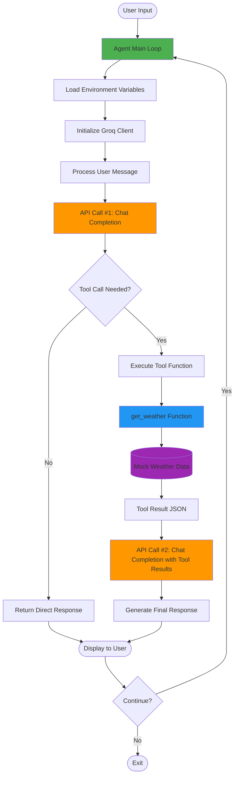
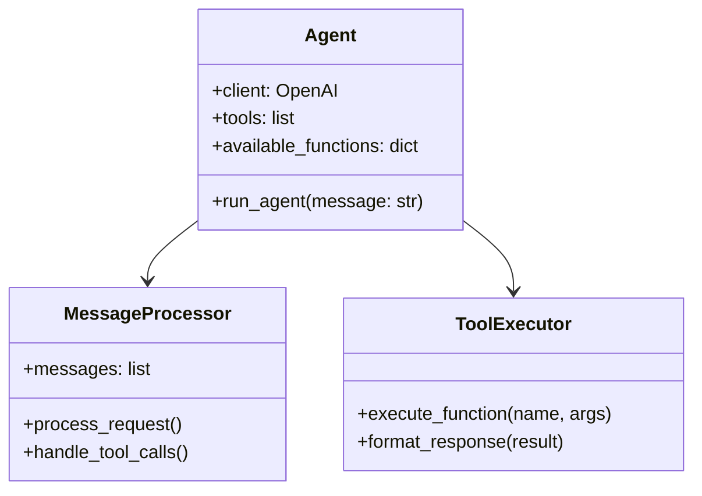
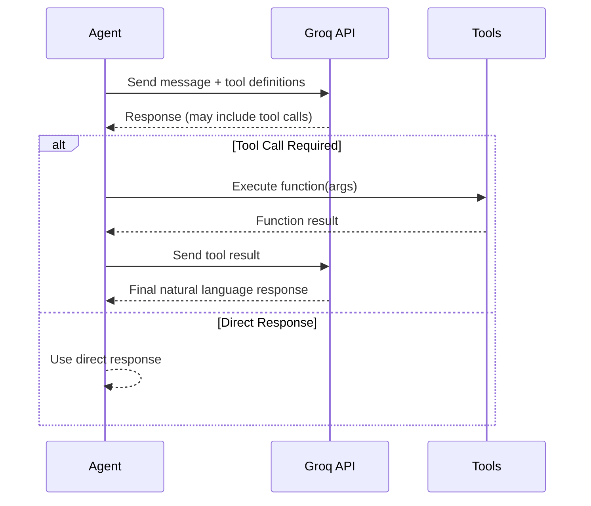
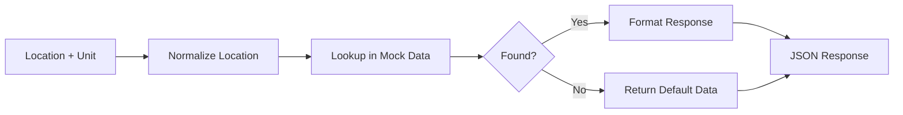
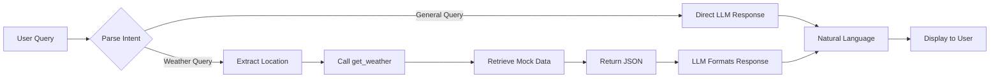

# Weather Agent Architecture

## System Overview

This document describes the architectural design of the Hello World Weather Agent.

## High-Level Architecture Diagram



## Component Breakdown

### 1. **User Interface Layer**
- **Terminal Input/Output**: Simple command-line interface for user interaction
- **Main Loop**: Continuous conversation loop until user exits
- **Input Validation**: Checks for exit commands and empty inputs

### 2. **Agent Core**


**Key Functions:**
- `run_agent(user_message)`: Main orchestration function
- Manages conversation context
- Handles API communication
- Coordinates tool execution

### 3. **LLM Integration Layer**


**Features:**
- **Model**: Llama 3.3 70B (via Groq)
- **Function Calling**: Automatic tool selection
- **Context Management**: System + user messages
- **Error Handling**: API errors and quota issues

### 4. **Tool System**

#### Tool Definition Schema
```json
{
  "type": "function",
  "function": {
    "name": "get_weather",
    "description": "Get current weather for a location",
    "parameters": {
      "type": "object",
      "properties": {
        "location": {
          "type": "string",
          "description": "City name"
        },
        "unit": {
          "type": "string",
          "enum": ["celsius", "fahrenheit"]
        }
      },
      "required": ["location"]
    }
  }
}
```

#### Weather Tool Implementation


**Mock Data Structure:**
```python
{
    "location": "New York",
    "temperature": 72,
    "unit": "fahrenheit",
    "condition": "sunny",
    "humidity": 65
}
```

### 5. **Data Flow**



## Technology Stack

| Component | Technology | Purpose |
|-----------|-----------|---------|
| **Language** | Python 3.10+ | Core implementation |
| **LLM Provider** | Groq | Free, fast API access |
| **LLM Model** | Llama 3.3 70B Versatile | Chat and function calling |
| **API Client** | OpenAI SDK | Groq-compatible client |
| **Config** | python-dotenv | Environment variable management |
| **Data Format** | JSON | Tool responses and API communication |

## Key Design Patterns

### 1. **Function Registry Pattern**
```python
available_functions = {
    "get_weather": get_weather
}
# Allows dynamic function lookup and execution
```

### 2. **Tool Abstraction Pattern**
- Tools defined declaratively (JSON schema)
- Execution separated from definition
- Easy to add new tools

### 3. **Message Context Pattern**
```python
messages = [
    {"role": "system", "content": "..."},
    {"role": "user", "content": "..."},
    {"role": "assistant", "content": "...", "tool_calls": [...]},
    {"role": "tool", "content": "..."}
]
```

## Extensibility Points

### Adding New Tools
1. Define the tool function
2. Add function schema to `tools` list
3. Register in `available_functions` dict

### Example: Calculator Tool
```python
def calculate(expression: str) -> dict:
    result = eval(expression)  # Use safe eval in production!
    return {"expression": expression, "result": result}

# Add to tools list and available_functions
```

### Switching LLM Providers
- Change `base_url` in OpenAI client initialization
- Update `GROQ_API_KEY` → `OTHER_API_KEY`
- Adjust model name if needed

## Security Considerations

1. **API Key Management**
   - Stored in `.env` (not in version control)
   - Loaded via `python-dotenv`
   - Never logged or displayed

2. **Input Validation**
   - User inputs are passed to LLM (sandboxed)
   - Tool parameters validated by LLM

3. **Mock Data**
   - Weather tool uses simulated data
   - No external API calls (no data leakage)

## Performance Characteristics

- **First Response Time**: ~1-2 seconds
- **Tool Call Response**: ~2-3 seconds (includes function execution)
- **Groq Inference Speed**: Very fast (faster than OpenAI)
- **Rate Limits**: Groq free tier (6000 requests/minute)

## Future Enhancements

1. **Real Weather API Integration**
   - OpenWeatherMap, WeatherAPI, etc.
   - API key management for multiple services

2. **Conversation Memory**
   - Persistent message history
   - Context window management

3. **Multi-Tool Orchestration**
   - Chain multiple tool calls
   - Parallel tool execution

4. **Enhanced Error Handling**
   - Retry logic for API failures
   - Graceful degradation

5. **Web Interface**
   - Streamlit or Flask frontend
   - Chat history visualization
   - Real-time streaming responses

---

**Last Updated**: January 28, 2026
