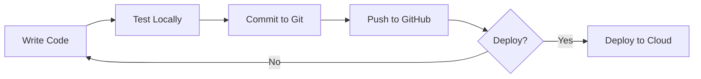

# Technology Stack

Complete list of all technologies, tools, and services used in the Weather Agent project.

---

## Core Technologies

### Programming Language
| Technology | Version | Purpose |
|-----------|---------|---------|
| **Python** | 3.10+ | Primary programming language for agent implementation |

### AI/LLM Services
| Technology | Provider | Purpose | Cost |
|-----------|----------|---------|------|
| **Groq API** | Groq Inc. | LLM inference platform for fast AI responses | Free tier available |
| **Llama 3.3 70B Versatile** | Meta (via Groq) | Large language model for chat and function calling | Included in Groq free tier |

---

## Python Dependencies

### Required Packages

#### 1. **openai** (>=1.12.0)
- **Purpose**: Official OpenAI Python client library
- **Used For**: 
  - Communicating with Groq API (OpenAI-compatible)
  - Sending chat completion requests
  - Handling function/tool calling
  - Managing conversation context
- **Installation**: `pip install openai>=1.12.0`
- **Documentation**: https://github.com/openai/openai-python
- **License**: MIT

#### 2. **python-dotenv** (>=1.0.0)
- **Purpose**: Load environment variables from `.env` files
- **Used For**:
  - Managing API keys securely
  - Configuration management
  - Keeping secrets out of source code
- **Installation**: `pip install python-dotenv>=1.0.0`
- **Documentation**: https://github.com/theskumar/python-dotenv
- **License**: BSD-3-Clause

### Standard Library Modules

| Module | Purpose |
|--------|---------|
| `os` | Operating system interface, environment variable access |
| `json` | JSON parsing and serialization for API responses |

---

## Development Tools

### Code Editor
| Tool | Version | Purpose |
|------|---------|---------|
| **Visual Studio Code** | Latest | Primary IDE for development |
| **Python Extension** | Latest | Python language support, IntelliSense, debugging |

### Version Control
| Tool | Purpose |
|------|---------|
| **Git** | Source code version control |
| **GitHub** | Remote repository hosting |

### Package Management
| Tool | Purpose |
|------|---------|
| **pip** | Python package installer |
| **virtualenv** | Python virtual environment (`.venv`) |

### Terminal
| Tool | OS | Purpose |
|------|-----|---------|
| **PowerShell** | Windows | Command-line interface for running agent |
| **Windows Terminal** | Windows | Modern terminal emulator (optional) |

---

## APIs and Services

### Groq API
- **Endpoint**: `https://api.groq.com/openai/v1`
- **Authentication**: API Key (Bearer token)
- **Protocol**: REST API (HTTPS)
- **Format**: JSON
- **Rate Limits**: 6,000 requests/minute (free tier)
- **Models Available**:
  - llama-3.3-70b-versatile
  - llama-3.1-70b-versatile
  - llama-3.1-8b-instant
  - mixtral-8x7b-32768

### Function Calling Protocol
- **Standard**: OpenAI Function Calling API
- **Format**: JSON Schema for tool definitions
- **Supported Features**:
  - Automatic tool selection
  - Parameter validation
  - Multi-tool support
  - Tool result feedback

---

## Configuration & Environment

### Environment Variables
| Variable | Purpose | Format |
|----------|---------|--------|
| `GROQ_API_KEY` | API authentication | String (gsk_...) |

### Configuration Files
| File | Purpose | Format |
|------|---------|--------|
| `.env` | Environment variables (local, not committed) | KEY=value |
| `.env.example` | Template for environment setup | KEY=value |
| `requirements.txt` | Python dependencies | package>=version |

---

## Data Formats

### Input/Output Formats
| Format | Used For |
|--------|----------|
| **JSON** | API requests/responses, tool definitions, function results |
| **Plain Text** | User input/output in terminal |
| **Markdown** | Documentation (README, ARCHITECTURE) |

### Message Format (OpenAI Chat Protocol)
```json
{
  "role": "system|user|assistant|tool",
  "content": "message text",
  "tool_calls": [...],
  "tool_call_id": "..."
}
```

---

## Operating System Requirements

### Supported Platforms
| OS | Version | Notes |
|----|---------|-------|
| **Windows** | 10/11 | Primary development platform |
| **macOS** | 10.15+ | Fully compatible |
| **Linux** | Ubuntu 20.04+, Debian, etc. | Fully compatible |

### System Requirements
- **RAM**: 100MB minimum (lightweight)
- **Disk Space**: ~50MB (with dependencies)
- **Network**: Internet connection required for API calls
- **Python**: 3.8 or higher

---

## Security Technologies

### Security Measures
| Technology | Purpose |
|-----------|---------|
| **HTTPS/TLS** | Encrypted API communication |
| **Environment Variables** | Secret management (API keys) |
| **`.gitignore`** | Prevent committing secrets to version control |

### Not Included (Production Recommendations)
- Secrets manager (AWS Secrets Manager, Azure Key Vault)
- Rate limiting middleware
- Input sanitization libraries
- Logging and monitoring tools

---

## Alternative Technologies (Future Options)

### Alternative LLM Providers
| Provider | Model Options | Cost |
|----------|--------------|------|
| **OpenAI** | GPT-4, GPT-3.5 Turbo | Paid (per token) |
| **Anthropic** | Claude 3.5 Sonnet, Claude 3 Opus | Paid (per token) |
| **Google AI** | Gemini Pro | Free tier + paid |
| **Ollama** | Llama 3, Mistral (local) | Free (local inference) |
| **Together AI** | Various open-source models | Paid |

### Alternative Frameworks
| Framework | Purpose | Complexity |
|-----------|---------|-----------|
| **LangChain** | Advanced agent orchestration | Higher |
| **AutoGen** | Multi-agent collaboration | Higher |
| **Semantic Kernel** | Microsoft's AI orchestration | Medium |
| **Haystack** | NLP pipelines | Medium |

### Alternative Weather APIs (Future)
| API | Provider | Cost |
|-----|----------|------|
| **OpenWeatherMap** | OpenWeather | Free tier + paid |
| **WeatherAPI.com** | WeatherAPI | Free tier + paid |
| **Weather.gov** | NOAA (US only) | Free |
| **Weatherstack** | Apilayer | Free tier + paid |

---

## Documentation Tools

| Tool | Purpose |
|------|---------|
| **Markdown** | Documentation format |
| **Mermaid** | Diagram creation (in Markdown) |
| **VS Code Markdown Preview** | Document viewing |

---

## Testing & Debugging (Future)

### Recommended Tools
| Tool | Purpose |
|------|---------|
| **pytest** | Unit testing framework |
| **unittest** | Python built-in testing |
| **python-dotenv** | Testing with mock environment variables |
| **VS Code Debugger** | Interactive debugging |

---

## Deployment Options (Future)

### Containerization
| Technology | Purpose |
|-----------|---------|
| **Docker** | Container runtime |
| **Docker Compose** | Multi-container orchestration |

### Cloud Platforms
| Platform | Services |
|----------|----------|
| **AWS** | EC2, Lambda, ECS |
| **Azure** | Container Apps, Functions |
| **Google Cloud** | Cloud Run, Functions |
| **Heroku** | Easy deployment platform |

### Web Frameworks (for UI)
| Framework | Language | Purpose |
|-----------|----------|---------|
| **Streamlit** | Python | Quick web UI for data apps |
| **Flask** | Python | Lightweight web framework |
| **FastAPI** | Python | Modern API framework |

---

## Development Workflow



---

## Version Matrix

| Component | Current Version | Latest Available |
|-----------|----------------|------------------|
| Python | 3.10.4 | 3.12.x |
| openai | 1.12.0+ | 1.56.0+ |
| python-dotenv | 1.0.0+ | 1.0.1 |
| Groq API | v1 | v1 |
| Llama 3.3 | 70B Versatile | Latest |

---

## Learning Resources

### Official Documentation
- **Python**: https://docs.python.org/3/
- **OpenAI API**: https://platform.openai.com/docs
- **Groq**: https://console.groq.com/docs
- **Function Calling**: https://platform.openai.com/docs/guides/function-calling

### Tutorials & Guides
- OpenAI Cookbook: https://cookbook.openai.com/
- LangChain Documentation: https://python.langchain.com/
- Real Python Tutorials: https://realpython.com/

---

## License Information

### Project License
- **License**: MIT (recommended for open source)
- **Copyright**: © 2026

### Dependency Licenses
- **openai**: MIT License
- **python-dotenv**: BSD-3-Clause License
- **Python**: PSF License

### Model Licenses
- **Llama 3.3**: Meta's Llama 3 Community License

---

**Last Updated**: January 28, 2026  
**Project Version**: 1.0.0
